# Kubernetes-e2e-php

A containerized PHP blood-donation web application backed by MySQL — provisioned
on **Amazon EKS** with Terraform, built and hardened through a **Jenkins** CI
pipeline, and continuously delivered to the cluster with **ArgoCD** (GitOps),
with full high-availability and network-security controls.

---

## End-to-End CI/CD on Kubernetes (EKS + GitOps)


This project documents the complete journey of an application — from
infrastructure provisioning with **Terraform** (EKS cluster, node group, EBS CSI
driver), through a **Jenkins** CI pipeline (static analysis, quality gates,
image build, vulnerability scanning, registry push), to a GitOps rollout where
**ArgoCD** keeps the cluster continuously synced to the Kubernetes manifests in
this repository — ResourceQuota, ConfigMap, Secrets, Deployment, StatefulSet,
HPA, PDB, Ingress, and NetworkPolicy.

### Pipeline Overview

```
 ┌──[ 1 · PROVISION — TERRAFORM ]─────────────────────────────────────────┐
 │                                                                        │
 │ terraform apply ──► Amazon EKS "EKS_CLOUD" · Kubernetes v1.36          │
 │                     ├─ managed node group (EC2 workers)                │
 │                     └─ EBS CSI driver addon (dynamic gp2 volumes)      │
 │                                                                        │
 └────────────────────────────────────────────────────────────────────────┘
                                     │
                                     ▼
 ┌──[ 2 · CI — JENKINS PIPELINE ]─────────────────────────────────────────┐
 │                                                                        │
 │    ┌───────┐  ┌──────┐  ┌─────┐  ┌───────┐  ┌─────┐  ┌────┐  ┌────┐    │
 │    │CleanWs│─►│ Code │─►│ CQA │─►│Q-Gates│─►│Image│─►│Scan│─►│Push│    │
 │    └───────┘  └──────┘  └─────┘  └───────┘  └─────┘  └────┘  └─┬──┘    │
 │                                                   docker push  │       │
 │      ┌─────────────────────────────┐                           │       │
 │      │      DOCKER HUB / ECR       │◄──────────────────────────┘       │
 │      │ nikhilkotharu/k8s:appimage  │                                   │
 │      │ nikhilkotharu/k8s:dbimage   │                                   │
 │      └──────────────┬──────────────┘                                   │
 │                     │  git commit (new image tag)                      │
 │                     ▼                                                  │
 │      ┌─────────────────────────────┐                                   │
 │      │        GITHUB · main        │                                   │
 │      │  manifest-files/ updated    │                                   │
 │      │  with the latest image tag  │                                   │
 │      └─────────────────────────────┘                                   │
 │                                                                        │
 └────────────────────────────────────────────────────────────────────────┘
                                     │
                                     │  ArgoCD watches main
                                     ▼
 ┌──[ 3 · CD — ARGOCD (GITOPS) ]──────────────────────────────────────────┐
 │                                                                        │
 │ new commit on main detected ──► sync ──► manifests applied to EKS      │
 │ cluster nodes pull the tagged image from Docker Hub                    │
 │ Git is the source of truth · drift auto-heal · rollback = revert       │
 │                                                                        │
 └────────────────────────────────────────────────────────────────────────┘
                                     │
                                     ▼
 ┌──[ 4 · RUNTIME — AMAZON EKS "EKS_CLOUD" ]──────────────────────────────┐
 │                                                                        │
 │ Internet ──► ELB ──► Ingress (nginx) ──► mysvc ──► PHP pods ×2–7       │
 │                                            ▲             │             │
 │              HPA (CPU 20%) · PDB (min 2) ──┘             │ :3306       │
 │                                                          ▼             │
 │              mysqldb (headless svc) ──► mysql-0 [StatefulSet]          │
 │              Secret credentials         └─► PVC 2Gi gp2 (EBS CSI)      │
 │                                                                        │
 │ ResourceQuota caps namespace CPU/memory · NetworkPolicy allows         │
 │ only ingress-nginx :80 in · only DB :3306 + DNS :53 out                │
 │                                                                        │
 └────────────────────────────────────────────────────────────────────────┘
```

---

## Part 1 — Infrastructure Provisioning (Terraform → Amazon EKS)

The entire cluster is provisioned as code with **Terraform**: the EKS control
plane (`EKS_CLOUD`, Kubernetes `1.36`), a managed node group, and the
**EBS CSI driver addon** — which later enables dynamic `gp2` volume
provisioning for the database's `volumeClaimTemplates`.

```bash
terraform init      # download providers, initialize state
terraform plan      # preview the infrastructure changes
terraform apply     # EKS cluster + node group + EBS CSI addon
```

A single apply brings up all 10 resources and emits the cluster endpoint as an
output; `kubectl` access is wired up with `aws eks update-kubeconfig`:

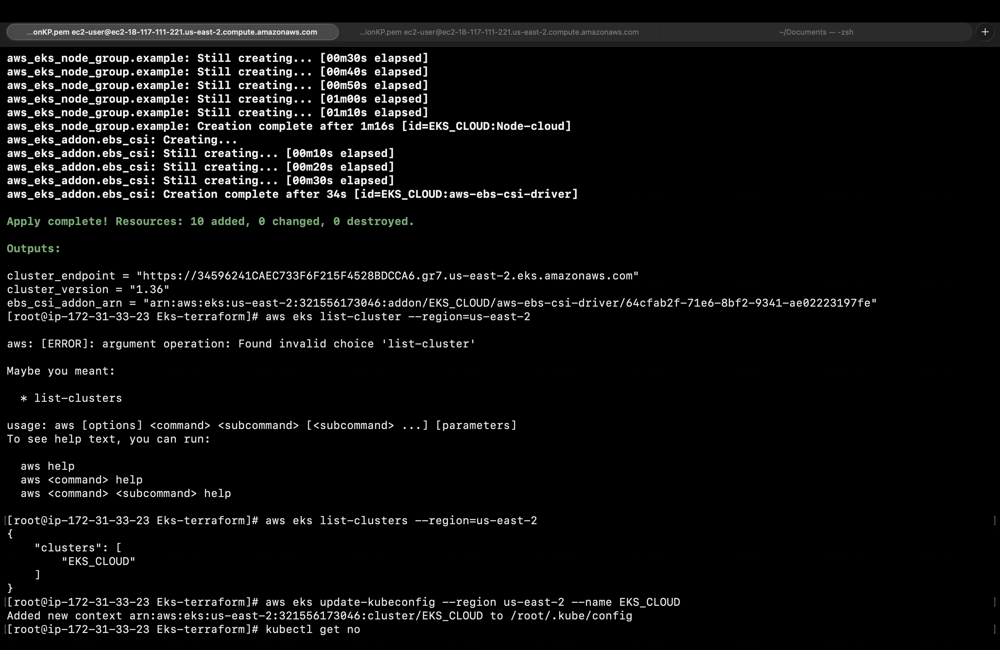

```bash
aws eks list-clusters --region us-east-2          # ["EKS_CLOUD"]
aws eks update-kubeconfig --region us-east-2 --name EKS_CLOUD
kubectl get no                                    # nodes ready
```

The cluster shows **Active** in the AWS console with zero health or capability
issues:

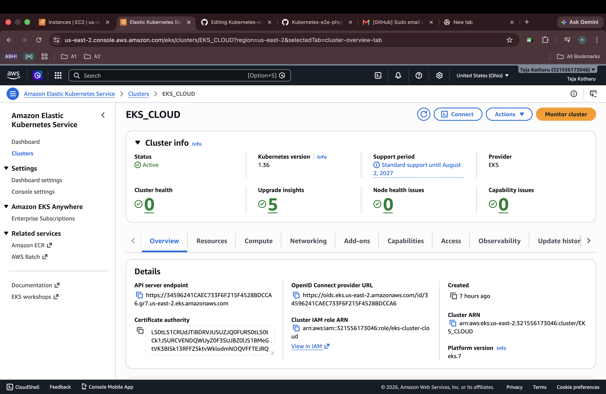

---

## Part 2 — Continuous Integration (Jenkins)

The CI pipeline runs seven stages — workspace cleanup, checkout, code quality
analysis, a blocking quality gate, image build, vulnerability scan, and
registry push — completing in under a minute per run:

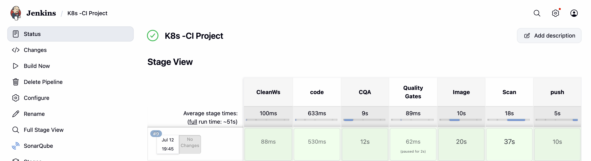

### Stage 1 — Source Code Management

Jenkins checks out the application source — the PHP frontend and the MySQL
database initializer (each with its own `Dockerfile`) — from GitHub.

```groovy
stage('code') {
    steps {
        git branch: 'main',
            url: 'https://github.com/nikhilsaishankar/Kubernetes-e2e-php.git'
    }
}
```

### Stage 2 — Code Quality Analysis (SonarQube)

Static analysis runs against the source with **SonarQube**. The dashboard
reports bugs, vulnerabilities, security hotspots, code smells, and duplication
— with the overall **quality gate passing**:

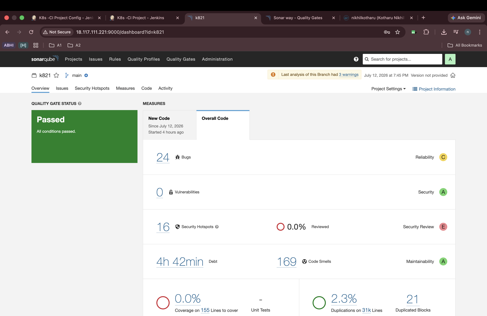

### Stage 3 — Quality Gate (blocking)

The pipeline waits on SonarQube's **Sonar way** gate — no new bugs, no new
vulnerabilities, all hotspots reviewed, limited debt and duplication. A failing
gate aborts the build; no image is ever built from failing code.

```groovy
stage('Quality Gates') {
    steps {
        timeout(time: 5, unit: 'MINUTES') {
            waitForQualityGate abortPipeline: true   // hard stop on failure
        }
    }
}
```

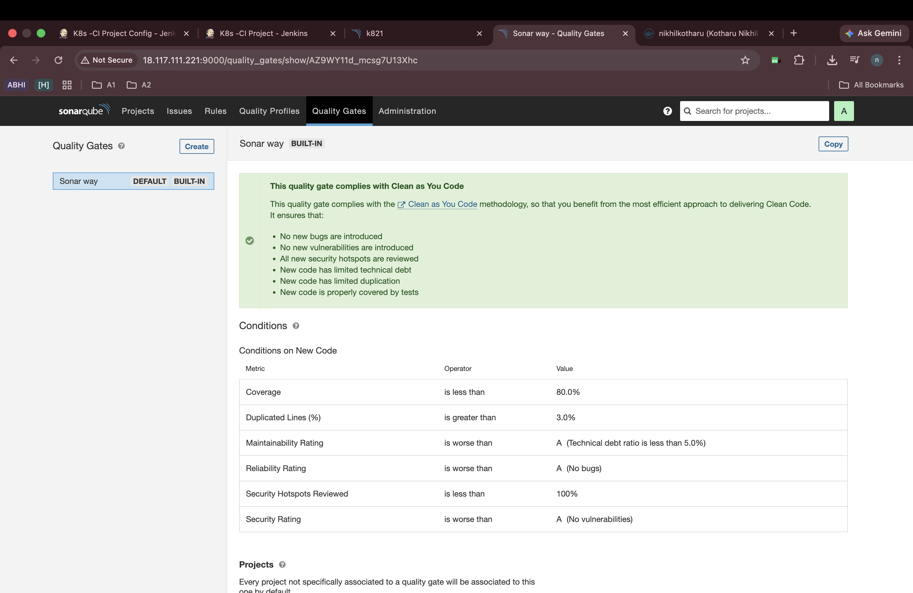

### Stage 4 — Docker Image Build

Two images are built from the `Dockerfile`s tracked in this repository:

- **Application image** — PHP 7.2 + Apache with the `mysqli` extension,
  serving the blood-donation frontend.
- **Database image** — MySQL 5.7 seeded with the `customers` schema
  (`donors` and `users` tables) via `init.sql`.

```bash
# Application image (php:7.2-apache + mysqli)
docker build -t nikhilkotharu/k8s:appimage .

# Database image (mysql 5.7 + customers schema)
docker build -t nikhilkotharu/k8s:dbimage ./database
```

### Stage 5 — Image Security Scan (Trivy)

**Trivy** scans both freshly built images for OS-package and dependency
vulnerabilities — a security gate before anything reaches the registry.

```bash
# Scan images — gate on HIGH/CRITICAL findings
trivy image --severity HIGH,CRITICAL nikhilkotharu/k8s:appimage
trivy image --severity HIGH,CRITICAL nikhilkotharu/k8s:dbimage
```

### Stage 6 — Push to Registry (Docker Hub)

Images that clear the Trivy gate are pushed to **Docker Hub**, so every
cluster node pulls identical, scanned artifacts:

```bash
docker login -u nikhilkotharu
docker push nikhilkotharu/k8s:appimage
docker push nikhilkotharu/k8s:dbimage
```

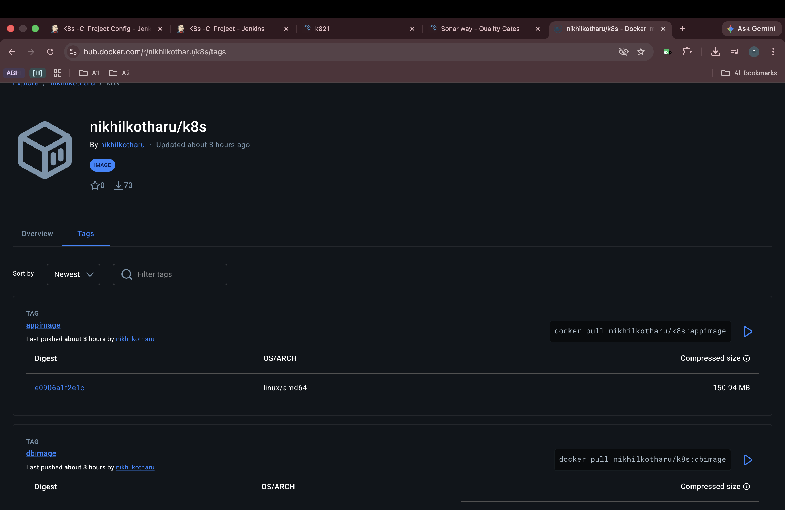

**This completes the CI pipeline** — code has been analyzed, gated, built,
scanned, and published. Delivery to the cluster is handled declaratively by
ArgoCD from here on.

---

## Part 3 — Kubernetes Manifests (High Availability by Design)

All workloads are declared in [`manifest-files/`](./manifest-files). Each
manifest solves a specific production concern — resource governance,
configuration, availability, persistence, secrecy, routing, and network
isolation.

### 3.1 Resource Governance — `resourcequota.yml`

Before any workload is scheduled, a **ResourceQuota** caps the namespace's
total CPU and memory so no deployment can starve the cluster.

```yaml
apiVersion: v1
kind: ResourceQuota
metadata:
  name: rq1
spec:
  hard:
    requests.cpu: '2'
    limits.cpu: '4'
    requests.memory: '5Gi'
    limits.memory: '10Gi'
```

Because a quota is active, **every pod in the namespace must declare
`requests` and `limits`** — which the Deployment and StatefulSet below do.

### 3.2 Application Configuration — `configmap.yml`

Environment-specific values (database host and port) are externalized into a
**ConfigMap** instead of being baked into the image, so the same image runs
unchanged across environments.

```yaml
apiVersion: v1
kind: ConfigMap
metadata:
  name: mycmap
data:
  DB_HOST: mysqldb
  DB_PORT: "3306"
```

### 3.3 Stateless Workload — `deployment.yml`

The PHP frontend runs as a **Deployment**, which integrates both the
ResourceQuota (via per-container `requests`/`limits`) and the ConfigMap
(via `envFrom`). Liveness and readiness probes let Kubernetes restart
unhealthy pods and hold traffic until a pod is actually ready.

```yaml
apiVersion: apps/v1
kind: Deployment
metadata:
  name: mydeploy
spec:
  replicas: 2
  selector:
    matchLabels:
      app: dev
  template:
    metadata:
      labels:
        app: dev
    spec:
      containers:
        - name: cont01
          image: nikhilkotharu/k8s:appimage
          ports:
            - containerPort: 80
          envFrom:
            - configMapRef:
                name: mycmap            # inject DB_HOST / DB_PORT
          resources:
            requests: { cpu: "100m", memory: "128Mi" }   # quota-compliant
            limits:   { cpu: "200m", memory: "256Mi" }
          livenessProbe:
            httpGet: { path: /, port: 80 }
            initialDelaySeconds: 30
            periodSeconds: 5
          readinessProbe:
            httpGet: { path: /, port: 80 }
            initialDelaySeconds: 10
            periodSeconds: 5
```

### 3.4 Exposing the Pods — `svc.yml`

A **ClusterIP Service** gives the frontend pods a stable virtual IP and
load-balances across all replicas selected by `app: dev`.

```yaml
apiVersion: v1
kind: Service
metadata:
  name: mysvc
spec:
  type: ClusterIP
  selector:
    app: dev
  ports:
    - port: 80
      targetPort: 80
```

### 3.5 High Availability — `hpa.yml` + `pdb.yml`

A **HorizontalPodAutoscaler** scales the Deployment between 2 and 7 replicas
based on CPU utilization, while a **PodDisruptionBudget** guarantees a minimum
of 2 pods stay up during voluntary disruptions (node drains, upgrades).

```yaml
apiVersion: autoscaling/v2
kind: HorizontalPodAutoscaler
metadata:
  name: hpa
spec:
  scaleTargetRef:
    apiVersion: apps/v1
    kind: Deployment
    name: mydeploy
  minReplicas: 2
  maxReplicas: 7
  metrics:
    - type: Resource
      resource:
        name: cpu
        target:
          type: Utilization
          averageUtilization: 20     # scale out early under load
```

```yaml
apiVersion: policy/v1
kind: PodDisruptionBudget
metadata:
  name: bankapp-pdb
spec:
  minAvailable: 2
  selector:
    matchLabels:
      app: dev
```

### 3.6 Encrypted Credentials — `secret.yml`

Database credentials never appear in plain text in the manifests. They are
stored as an **Opaque Secret** (base64-encoded, encryptable at rest) and
injected into the database pod via `envFrom`.

```yaml
apiVersion: v1
kind: Secret
metadata:
  name: mysec
type: Opaque
data:
  DB_USER: cm9vdA==          # base64
  DB_PASSWORD: YWRtaW4xMjM=  # base64
  DB_NAME: Y3VzdG9tZXJz      # base64
```

### 3.7 Stable Network Identity — `dbsvc.yml` (Headless Service)

Stateful workloads need a **stable DNS identity per pod**, not a
load-balanced VIP. Setting `clusterIP: None` creates a **headless Service**;
the StatefulSet references it via `serviceName`, giving each replica a
predictable hostname (`mysql-0.mysqldb`).

```yaml
apiVersion: v1
kind: Service
metadata:
  name: mysqldb
spec:
  clusterIP: None          # headless — per-pod DNS, no VIP
  selector:
    app: dbdev
  ports:
    - port: 3306
      targetPort: 3306
```

### 3.8 Stateful Backend — `statefulset.yml`

MySQL runs as a **StatefulSet** — ordered, identity-preserving pods with
dedicated storage. A **`volumeClaimTemplates`** block (available *only* on
StatefulSets) provisions a PersistentVolumeClaim per replica from the AWS
`gp2` StorageClass — dynamically fulfilled by the **EBS CSI driver** installed
by Terraform in Part 1 — so data survives pod rescheduling. Credentials come
from the Secret above.

```yaml
apiVersion: apps/v1
kind: StatefulSet
metadata:
  name: mysql
spec:
  serviceName: mysqldb          # binds to the headless service
  replicas: 1
  selector:
    matchLabels:
      app: dbdev
  template:
    metadata:
      labels:
        app: dbdev
    spec:
      containers:
        - name: dbcont01
          image: nikhilkotharu/k8s:dbimage
          ports:
            - containerPort: 3306
          envFrom:
            - secretRef:
                name: mysec       # encrypted credentials
          resources:
            requests: { cpu: "100m", memory: "128Mi" }
            limits:   { cpu: "200m", memory: "256Mi" }
          volumeMounts:
            - name: pvc-1
              mountPath: /var/lib/mysql
  volumeClaimTemplates:           # one PVC per replica, auto-provisioned
    - metadata:
        name: pvc-1
      spec:
        accessModes:
          - ReadWriteOnce
        storageClassName: gp2     # AWS EBS dynamic provisioning
        resources:
          requests:
            storage: 2Gi
```

### 3.9 Traffic Routing — `ingress.yml`

An **Ingress** (backed by the NGINX ingress controller, exposed through an AWS
ELB) routes external HTTP traffic to the frontend Service, keeping a single
managed entry point into the cluster.

```yaml
apiVersion: networking.k8s.io/v1
kind: Ingress
metadata:
  name: bankappingress
  annotations:
    nginx.ingress.kubernetes.io/rewrite-target: /
spec:
  ingressClassName: nginx
  rules:
    - http:
        paths:
          - path: /
            pathType: Prefix
            backend:
              service:
                name: mysvc
                port:
                  number: 80
```

### 3.10 Network Isolation — `netpol.yml`

A **NetworkPolicy** locks the frontend pods down to exactly three flows,
selected by pod labels — everything else is denied:

1. **Ingress**: incoming traffic on port 80 *only* from the ingress-nginx
   controller (source selected by namespace + pod label).
2. **Egress → database**: outgoing traffic *only* to pods labeled
   `app: dbdev` on port 3306 (destination selected by pod label).
3. **Egress → DNS**: UDP 53 to `kube-system`, so the pods can resolve the
   headless service name through cluster DNS.

```yaml
apiVersion: networking.k8s.io/v1
kind: NetworkPolicy
metadata:
  name: bankapp-allow-ingress
spec:
  podSelector:
    matchLabels:
      app: dev                       # policy applies to frontend pods
  policyTypes:
    - Ingress
    - Egress
  ingress:
    - ports:
        - port: 80
      from:
        - namespaceSelector:
            matchLabels:
              kubernetes.io/metadata.name: ingress-nginx
          podSelector:
            matchLabels:
              kubernetes.io/metadata.name: ingress-nginx
  egress:
    - to:
        - podSelector:
            matchLabels:
              app: dbdev             # only the MySQL pods
      ports:
        - port: 3306
    - to:
        - namespaceSelector:
            matchLabels:
              kubernetes.io/metadata.name: kube-system
      ports:
        - protocol: UDP
          port: 53                   # cluster DNS resolution
```

---

## Part 4 — GitOps Continuous Delivery (ArgoCD)

Deployment is **pull-based, not push-based**. Instead of Jenkins running
`kubectl apply`, **ArgoCD** runs inside the EKS cluster and continuously
reconciles the live state against the manifests on this repository's `main`
branch — Git is the single source of truth. Any drift between the cluster and
Git is detected and can be healed automatically; any change merged to `main`
rolls out on the next sync.

The `myapp` Application tracks `manifest-files/` and reports **Synced** and
**Healthy** — every resource from Parts 3.1–3.10 (ConfigMap, ResourceQuota,
Secret, both Services, Deployment with its ReplicaSets and pods, StatefulSet
with its PVC and `mysql-0`, HPA, Ingress, NetworkPolicy, and PDB) is visible in
the application tree, pinned to the exact Git commit that produced it:

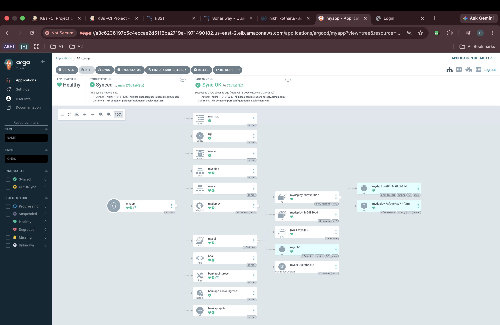

ArgoCD's network view confirms the full traffic path end to end: the AWS ELB
terminates at the **Ingress**, which routes to **mysvc** and onto the two
frontend pods, while **mysqldb** (headless) resolves directly to the `mysql-0`
StatefulSet pod:

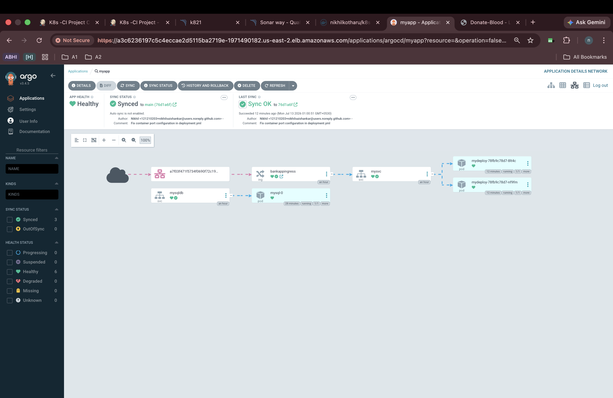

Manual bootstrap (reference — after this, sync is continuous):

```bash
# Install ArgoCD and expose its API server
kubectl create namespace argocd
kubectl apply -n argocd -f \
  https://raw.githubusercontent.com/argoproj/argo-cd/stable/manifests/install.yaml

# Register this repo as an Application (via UI or CLI)
argocd app create myapp \
  --repo https://github.com/nikhilsaishankar/Kubernetes-e2e-php.git \
  --path manifest-files \
  --dest-server https://kubernetes.default.svc \
  --dest-namespace default

argocd app sync myapp
```

Useful verification commands on the cluster:

```bash
kubectl get deploy,sts,svc,hpa,pdb,ingress,netpol
kubectl get pvc                    # PVC created by volumeClaimTemplates
kubectl describe quota rq1         # quota usage vs. hard limits
kubectl get hpa hpa --watch        # autoscaling in action
```

---

## Part 5 — Verification

With the stack synced, the application is reachable through the ELB / Ingress
endpoint and serves the login page:

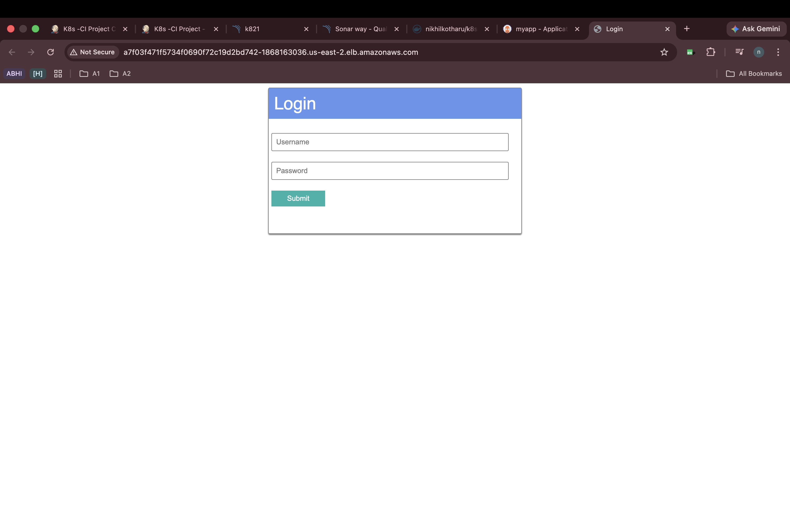

The registration flow renders and accepts new users — confirming routing
through Ingress → Service → pods works end to end:

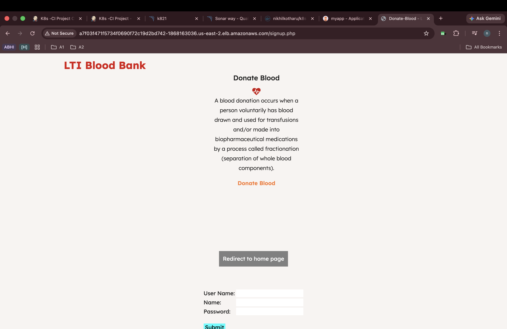

Connecting to the MySQL StatefulSet confirms the `customers` database was
seeded by `init.sql`, and that a user registered through the web UI landed in
the `users` table — proving the full web ↔ database round-trip (including the
NetworkPolicy-restricted 3306 path and DNS resolution of the headless
service):

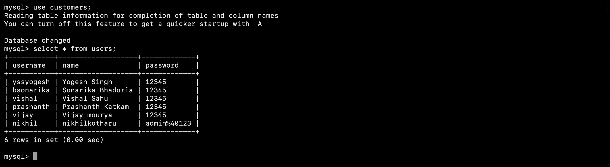

---

## Manifest Reference

| Manifest | Kind | Purpose |
|----------|------|---------|
| `resourcequota.yml` | ResourceQuota | Namespace-wide CPU/memory ceilings |
| `configmap.yml` | ConfigMap | Externalized DB host/port configuration |
| `deployment.yml` | Deployment | PHP frontend — replicas, probes, resources, ConfigMap env |
| `svc.yml` | Service (ClusterIP) | Stable VIP + load balancing for frontend pods |
| `hpa.yml` | HorizontalPodAutoscaler | Auto-scale 2→7 replicas at 20% CPU |
| `pdb.yml` | PodDisruptionBudget | Keep ≥2 frontend pods during disruptions |
| `secret.yml` | Secret (Opaque) | Encrypted DB credentials |
| `dbsvc.yml` | Service (headless) | Per-pod DNS identity for the StatefulSet |
| `statefulset.yml` | StatefulSet | MySQL with per-replica PVC via `volumeClaimTemplates` |
| `ingress.yml` | Ingress (nginx) | External HTTP routing to the frontend Service |
| `netpol.yml` | NetworkPolicy | Label-based ingress/egress allow-list + DNS |

## Tooling Summary

| Phase | Tool | Purpose |
|-------|------|---------|
| Infra | Terraform | Provision EKS cluster, node group, EBS CSI addon |
| Infra | Amazon EKS | Managed Kubernetes control plane (v1.36) |
| CI 1 | Git / GitHub | Source code management |
| CI 2 | Jenkins | Pipeline orchestration |
| CI 3 | SonarQube | Static analysis & blocking quality gate |
| CI 4 | Docker | Image build (app + db) |
| CI 5 | Trivy | Image vulnerability scanning |
| CI 6 | Docker Hub | Container registry |
| CD | ArgoCD | GitOps sync — Git as the source of truth |
| CD | Kubernetes | Orchestration, HA, storage, network policy |
